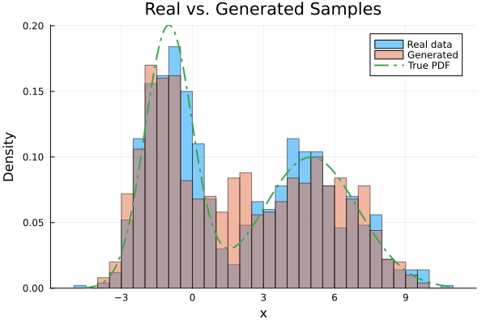
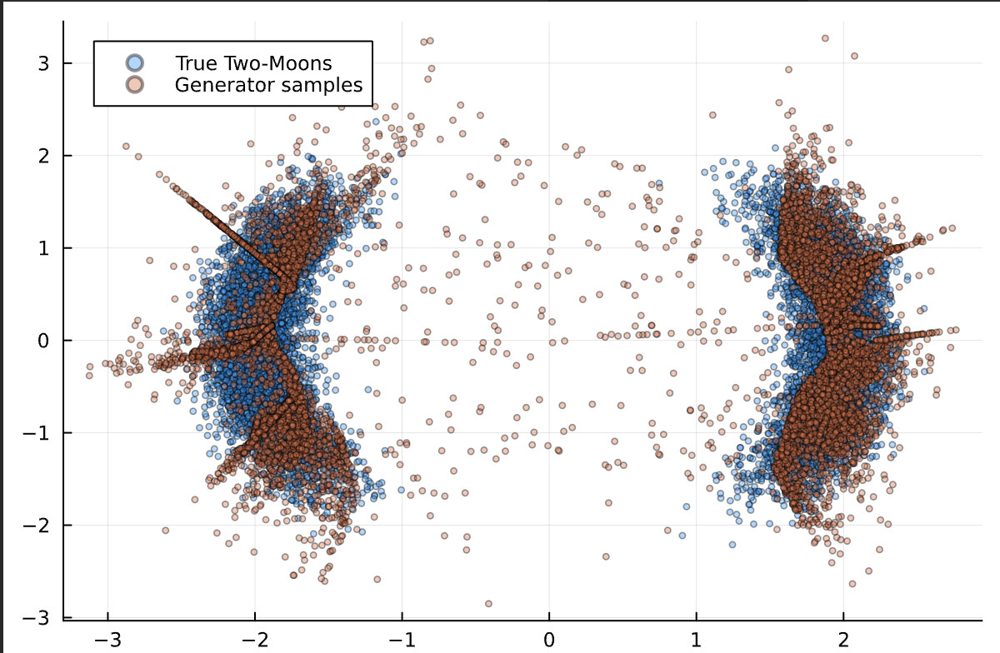
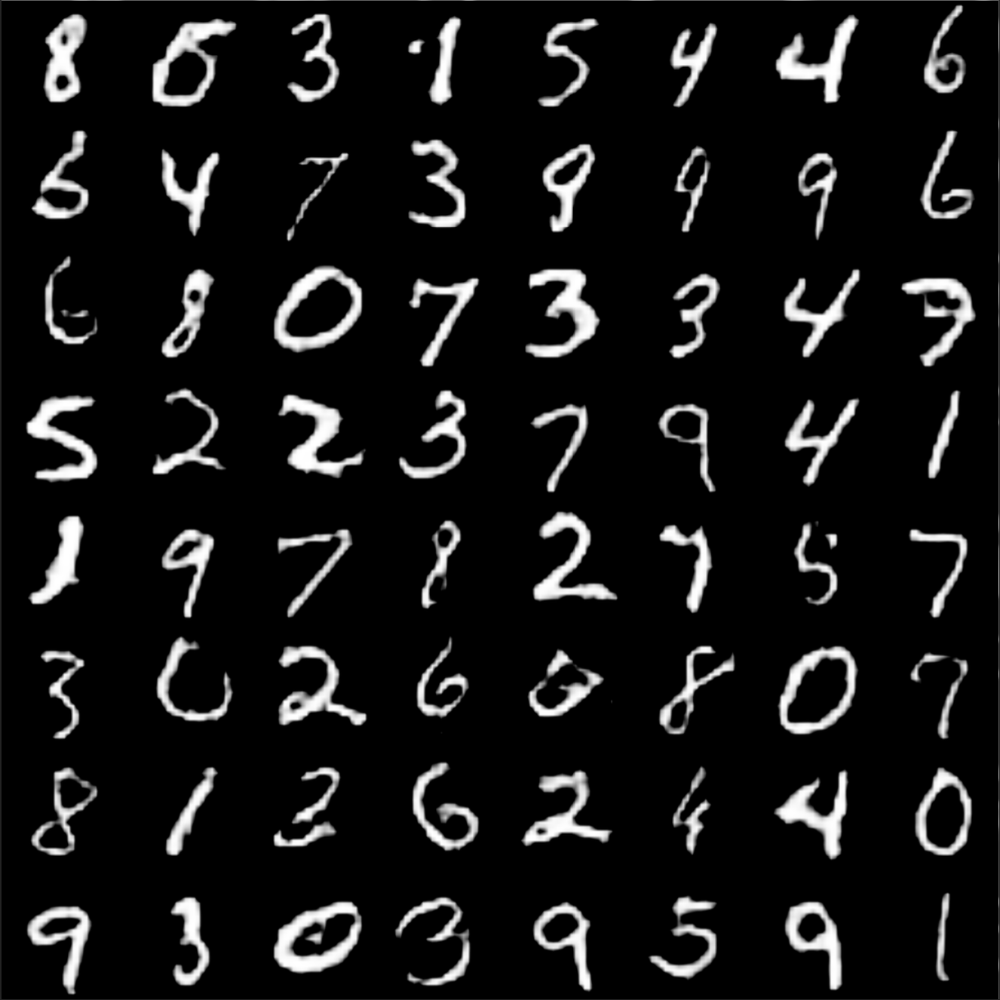

# dual-ISL: Explicit Density Approximation for Neural Implicit Samplers Using a Bernstein-Based Convex Divergence

## How to install

To install **dual-ISL**, use Julia’s built-in package manager. The repository includes both a `Project.toml` and a `Manifest.toml` for reproducibility. Because the module isn’t registered in the General registry, you’ll need to clone the repository and then:

````
julia> push!(LOAD_PATH,pwd()) # You are in the dual-ISL Repository
````

To reproduce the enviroment for compiling the repository:
````
(@v1.11) pkg>  activate pathToRepository/dual-ISL
````


## Quick Start Guide

After installing the package, you can immediately start experimenting with the examples provided in the. These examples are designed to help you understand how to apply the package for different statistical learning tasks, including learning 1-D distributions (`1d_distributions.jl`), 2-D distributions(`2d_distributions.jl`) and High dimensional data (`MNIST.jl`)

## Learning 1-D distributions

The following example demonstrates how to learn a 1-D distribution from a benchmark dataset. It utilizes a simple neural network architecture for both the generator and the discriminator within the context of an Invariant Statistical Learning (ISL) framework.

```julia
# Load the custom statistical loss functions
include("StatisticalLoss.jl")
# Note: To use exported names, uncomment the following line
# using StatisticalLoss

# Load required packages
using Distributions        # For probability distributions and random sampling
using Parameters: @with_kw # For convenient keyword-based constructors
using Plots                # For data visualization

# Define the noise model: standard normal distribution with mean 0.0 and std 1.0
noise_model = Normal(0.0f0, 1.0f0)

# Number of synthetic samples for training and experiments
n_samples = 10000

# Generator network: maps a 1D input through a series of dense layers and ELU activations
gen = Chain(
    Dense(1, 7), elu,    # Input layer: 1 → 7 neurons, followed by ELU activation
    Dense(7, 13), elu,   # Hidden layer: 7 → 13 neurons, ELU
    Dense(13, 7), elu,   # Hidden layer: 13 → 7 neurons, ELU
    Dense(7, 1)          # Output layer: 7 → 1 neuron (no activation)
)

# Discriminator (or descriptor) network: estimates density with a final sigmoid layer
dscr = Chain(
    Dense(1, 11), elu,         # Input layer: 1 → 11 neurons, ELU
    Dense(11, 29), elu,        # Hidden layer: 11 → 29 neurons, ELU
    Dense(29, 11), elu,        # Hidden layer: 29 → 11 neurons, ELU
    Dense(11, 1, σ)            # Output layer: 11 → 1 neuron, sigmoid activation
)

# Hyperparameters structure with defaults for easy modification
@with_kw struct HParams
    K::Int = 10                       # Number of Monte Carlo samples or importance samples
    η::Float32 = 1e-2                 # Learning rate for generator
    τ::Float32 = 1e-2                 # Learning rate for discriminator
    epochs::Int = 1000                # Number of training epochs
    samples::Int = 1000               # Number of samples to draw for training
    noise_model::Distribution = Normal(0.0f0, 1.0f0) # Noise distribution
end

# Instantiate hyperparameters with default values
hparams = HParams()

# Define the target data distribution as a mixture of two Gaussians
target_model = MixtureModel([
    Normal(5.0f0, 2.0f0),            # Component at mean 5, std 2
    Normal(-1.0f0, 1.0f0)            # Component at mean -1, std 1
])

# Generate training data from the target distribution and convert to Float32
train_set = Float32.(rand(target_model, hparams.samples))

# Create a data loader for batching during training
loader = Flux.DataLoader(
    train_set;
    batchsize = 1000,                # Samples per batch
    shuffle = true,                  # Shuffle data each epoch
    partial = false                  # Drop incomplete batch if not full
)

# Compute the statistical loss between generator and real data using the custom function
loss = StatisticalLoss.invariant_statistical_loss(gen, loader, hparams)
```



## Learning 2-D distributions


```julia 
# Load custom statistical loss functions from local file
include("StatisticalLoss.jl")
# To use exported symbols, uncomment the next line:
# using StatisticalLoss

# Load dependencies
using Distributions        # For defining probability distributions and sampling
using Parameters: @with_kw # For easy keyword-based constructors for parameter structs
using Plots                # For visualization (not used directly here but available)
using LinearAlgebra        # For linear algebra utilities like Diagonal
using KernelDensity        # For kernel density estimation (optional helper)

## Define a 2D "Two Moons" target distribution for sampling ##

# Abstract type to allow multiple target distributions
abstract type Target end

# TwoMoons struct holds parameters for the moon-shaped distribution
mutable struct TwoMoons <: Target
    prop_scale::Float32   # Scaling factor for proposal samples
    prop_shift::Float32   # Shift applied to proposals
    n_dims::Int           # Dimensionality (2 for 2D)
    max_log_prob::Float32 # Upper bound on log-probability for rejection

    # Default constructor: scales = 6, shift = -3, dims = 2, max_log_prob init to 0
    TwoMoons() = new(6.0f0, -3.0f0, 2, 0.0f0)
end

# Compute approximate log-probability for each row of z (samples)
# z is an N×2 array: columns are x and y coordinates
function log_prob(z::AbstractArray)
    a = abs.(z[:, 1])                                 # absolute x-coordinate
    norm_z = vec(sqrt.(sum(z .^ 2; dims = 2)))        # radial distance from origin
    # Unnormalized log-density: two Gaussian-like rings plus a soft rectifier
    return -0.5 .* ((norm_z .- 2) ./ 0.2) .^ 2        # ring around radius=2, width=0.2
         .- 0.5 .* ((a .- 2) ./ 0.3) .^ 2            # ring in |x| near 2, width=0.3
         .+ log.(1 .+ exp.(-4 .* a ./ 0.09))         # smooth junction term
end

# Rejection sampling for TwoMoons: propose from uniform noise, accept/reject by log_prob
function rejection_sampling(model::TwoMoons, num_steps::Int)
    # Propose num_steps points from uniform [0,1)^2, then scale+shift
    eps = rand(Float32, num_steps, model.n_dims)
    z_prop = model.prop_scale .* eps .+ model.prop_shift
    # Uniform random thresholds for acceptance
    u = rand(Float32, num_steps)
    # Compute normalized acceptance probabilities
    p_accept = exp.(log_prob(z_prop) .- model.max_log_prob)
    # Accept proposals where p_accept > u
    mask = p_accept .> u
    return z_prop[mask, :]
end

# Sample exactly num_samples points by repeated rejection until enough accepted
function sample(model::TwoMoons, num_samples::Int)
    z = Array{Float32}(undef, 0, model.n_dims)  # start with empty array
    while size(z, 1) < num_samples
        batch = rejection_sampling(model, num_samples)
        # Determine how many more we need
        take = min(size(batch, 1), num_samples - size(z, 1))
        # Append first take rows
        z = vcat(z, batch[1:take, :])
    end
    return z
end

## Set up noise model for generator input (multivariate normal in 2D) ##
z_dim = 2
mean_vector = zeros(z_dim)                 # [0, 0]
cov_matrix = Diagonal(ones(z_dim))        # Identity covariance
noise_model = MvNormal(mean_vector, cov_matrix)

# Hyperparameters struct for sliced statistical loss
@with_kw struct HParamsSliced
    K::Int = 10                                    # number of MC projections
    m::Int = 10                                    # number of random directions per projection
    η::Float32 = 1e-2                              # learning rate for generator
    τ::Float32 = 1e-2                              # learning rate for projection network (if any)
    epochs::Int = 100                              # training epochs
    samples::Int = 1000                            # number of target samples per epoch
    noise_model::Distribution = noise_model        # noise distribution for generator
end

# Instantiate hyperparameters with defaults
hparams = HParamsSliced()

# Build generator network: maps 2D noise → 2D output via dense layers + activations
hidden_dim = 32
gen = Chain(
    Dense(z_dim, hidden_dim, relu),  # input layer (2 → 32)
    Dense(hidden_dim, hidden_dim, relu),
    # Example of custom RBF layer (commented out)
    # Dense(hidden_dim, hidden_dim, x -> rbf(x, 0.0f0, 1.0f0)),
    Dense(hidden_dim, hidden_dim, relu),
    Dense(hidden_dim, 2)             # output layer (32 → 2)
)

# Create and sample from the TwoMoons target distribution
d = TwoMoons()
raw_samples = sample(d, 10_000)                 # get 10000 points
# Columns are samples; Flux.DataLoader expects features in columns, so transpose
moons = permutedims(Float32.(raw_samples))

# Batch the data for training
batch_size = 1000
train_loader = Flux.DataLoader(
    moons;
    batchsize = batch_size,
    shuffle = true,
    partial = false
)

# Compute the sliced invariant statistical loss between generator and target data
loss = StatisticalLoss.invariant_statistical_loss_proj(gen, train_loader, hparams)
```



## MNIST


```julia
# Load GPU support and core libraries
using CUDA                        # For GPU acceleration
using MLDatasets                   # For standard datasets like MNIST
using Base.Iterators: partition   # For splitting indices into batches
using LinearAlgebra               # For linear algebra utilities
using Parameters: @with_kw        # For defining hyperparameter structs concisely
include("StatisticalLoss.jl")    # Custom statistical loss functions

# Create a data loader for MNIST images
function make_loader(batch_size)
    # 1) Load and normalize images on CPU
    imgs = Float32.(MLDatasets.MNIST(:train).features)  # size: 28×28×1×60000
    imgs .= (2.0f0 .* imgs .- 1.0f0)                     # rescale pixel values from [0,1] to [-1,1]

    # 2) Flatten images: reshape spatial dims into feature vectors
    #    New shape: (flattened_pixels=784, num_samples)
    flat = reshape(imgs, 28 * 28 * 1, :)

    # 3) Partition column indices into batches of size batch_size
    #    Then extract sub-matrices of flat for each batch
    return [flat[:, idxs] for idxs in partition(1:size(flat, 2), batch_size)]
end

# Weight initialization following DCGAN guidelines (https://arxiv.org/abs/1511.06434)
dcgan_init(shape...) = randn(Float32, shape...) * 0.02f0

# Define the Discriminator network
function Discriminator()
    return Chain(
        # Convolutional layer: 1 input channel → 64 feature maps
        Conv((4, 4), 1 => 64; stride = 2, pad = 1, init = dcgan_init),
        x -> leakyrelu.(x, 0.2f0),    # LeakyReLU activation
        Dropout(0.25),                # Dropout for regularization

        # Second conv layer: 64 → 128 maps
        Conv((4, 4), 64 => 128; stride = 2, pad = 1, init = dcgan_init),
        x -> leakyrelu.(x, 0.2f0),
        Dropout(0.25),

        # Flatten feature maps to a vector
        x -> reshape(x, 7 * 7 * 128, :),
        # Final dense layer to single logit output
        Dense(7 * 7 * 128, 1)
    )
end

# Define the Generator network
function Generator(latent_dim::Int)
    return Chain(
        # Map latent vector → flattened feature map
        Dense(latent_dim, 7 * 7 * 256),
        BatchNorm(7 * 7 * 256, relu),      # Batch normalization + ReLU
        x -> reshape(x, 7, 7, 256, :),     # Reshape to 7×7×256 feature maps

        # Upsample to 7×7→ (7→)14×14
        ConvTranspose((5, 5), 256 => 128; stride = 1, pad = 2, init = dcgan_init),
        BatchNorm(128, relu),

        # Upsample to 14×14→28×28
        ConvTranspose((4, 4), 128 => 64; stride = 2, pad = 1, init = dcgan_init),
        BatchNorm(64, relu),

        # Final conv to produce single-channel image, then tanh to map to [-1,1]
        ConvTranspose((4, 4), 64 => 1; stride = 2, pad = 1, init = dcgan_init),
        x -> tanh.(x)
    )
end

# Check if GPU is available and print a message
if CUDA.functional()
    @info "Training on GPU"
else
    @warn "Training on CPU, this will be very slow!"
end

# Define latent noise distribution (multivariate normal)
z_dim = 128
mean_vector = zeros(z_dim)                  # zero-mean
cov_matrix = Diagonal(ones(z_dim))         # identity covariance
noise_model = MvNormal(mean_vector, cov_matrix)

# Hyperparameter struct for multiscale statistical loss
@with_kw struct HParamsSliced
    K::Int = 10                             # number of projection scales
    m::Int = 10                             # number of random directions per scale
    η::Float32 = 1e-2                       # generator learning rate
    τ::Float32 = 1e-2                       # projection network learning rate
    epochs::Int = 100                       # training epochs
    samples::Int = 1000                     # number of samples to generate for loader
    latent_dim::Int = z_dim                 # latent space dimensionality
    noise_model::Distribution = noise_model # noise distribution for generator
end

# Instantiate hyperparameters
gpus_hparams = HParamsSliced()

# Prepare training data loader
#   make_loader returns a vector of batches; hcat to combine into one array for Flux.DataLoader
data_batches = make_loader(gpus_hparams.samples)
batch_size = 200
loader = Flux.DataLoader(hcat(data_batches...);
                         batchsize = batch_size,
                         shuffle = true,
                         partial = false)

# Instantiate the Generator and move it to GPU
gen = gpu(Generator(gpus_hparams.latent_dim))

# Define a set of scales for multiscale loss
Ks = [5, 10, 20]

# Compute multiscale invariant statistical loss on GPU
losses = StatisticalLoss.invariant_statistical_loss_multiscale_gpu(gen,
                                                                 loader,
                                                                 gpus_hparams,
                                                                 Ks)
```


